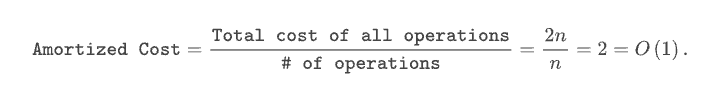
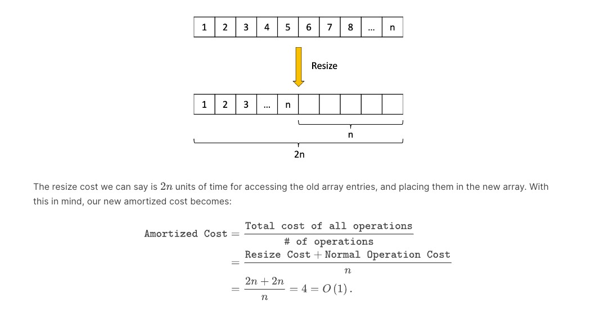

# Module 1. ArrayLists and Recursion

## Arrays and ArrayLists

### Arrays

- allocation of **contiguous** blocks of memory
- each cell store a single element
- search is $**O(n)**$ linear time
- access is $**O(1)**$
- adding element out of array capacity bound take $O(n)$ time since we need to **copy all elements** to the new array

[Why accessing an index of an array is an O(1) operation](https://learning.edx.org/course/course-v1:GTx+CS1332xI+1T2024/block-v1:GTx+CS1332xI+1T2024+type@sequential+block@aa536463980148968b90824f51357811/block-v1:GTx+CS1332xI+1T2024+type@vertical+block@79d4ceb7eef6495eb13418d7491be42f)

In the case of arrays, the magical efficiency requires three things:

- The memory allocated needs to be contiguous; meaning that each array index occupies adjacent memory locations.
- The array needs to know the memory address of the very first entry in the array, index 0.
- The array's data typing needs to be defined beforehand.

If we know what data type the array will store, then we know exactly how much memory is required for storage of each
instance of the data (for example, the int typing in Java is always 32-bits: even if the number is small, 32-bits is
always allocated for an int).

With this information, we know the starting memory address (index 0), the number of memory addresses each index
occupies, and each index is contiguous in memory. This allows us to find the memory address of an index with some
arithmetic called pointer arithmetic. If we want to access index in the array, then the memory address we want is

    new_address = start_address + i * data_size

which is an operation since it's just 3 arithmetic operations (as opposed to , the size of the array).

### ArrayList

- add at back is amortized $O(1)$
- add anywhere else, worse case $O(1)$ need to shift data around to not overwrite data
- remove back is amortized $O(1)$
- remove anywhere else, worse case $O(1)$, need to shift data to maintain **zero-aligned requirement/contiguity**

## Abstract Data Types (ADTs)

- an **abstract/model description of the behaviors and operation** of a data type
- Actual concrete implementation is called **data structure**

## Amortized Analysis

- look at cost over time rather than the cost per operation
- For example, adding to back is amortized $O(1)$

**Add and without need to resize**

- putting data at index size and incrementing size for each sequences of n operations
- hence `2n`, number of operations is `n` => $\frac{2n}{n}$ => $O(1)$

**Add and need to resize and copy**

- How many operations are needed for adding `n` numbers?
- The cost of $i^{th}$ operation:

    - case 1: no resize needed, 1
    - case 2: resize needed. For which value of i we need to allocate new memory. When $i = 2^k+1$, where $k = 1,2...$
      e.g inital capacity is 1
        - init array, capacity 1, size 0, `[]`
        - add $1$, capacity 1, size 1,`[1]`
        - add $2$, capacity 2, size 2,`[1,2]`
        - add $3$, capacity 4, size 3,`[1,2,3,_]`
        - add $4$, capacity 4, size 4,`[1,2,3,4]`
        - add $5$, capacity 8, size 5 `[1,2,3,4,5,_,_,_]`
          Thus, at this step we need to

        1. allocate new memory
        2. copy over $2^K$ elements from old array into new array
        3. insert a new element
           This is $2^K+1$

- so $t(i)$ is either $2^K+1$ if i = $2^K+1$, or else 1
- so the total cost of adding `n` numbers would be: $\sum_{i = 1}^{n} t^i$, amortized cost is $\frac{\sum_{i = 1}^{n}
  t^i}{n}$

In either case, we have a 1 showing up and so summation over i = 1 to n results in n. The remainder comes
from the case 2 operations. These operations cannot happen too many times. It would just sum up to $log(n)$ times

- $\sum_{i = 1}^{n} t^i$ = n + $\sum_{k = 2^k + 1 \le n}^{} 2^k$ = n + $\sum_{k = 0}^{log(n)} 2^k$

- so the total cost would $n + 2^{log(n)}$ < $2n$ (as $2^{log(n)} < n$) => $\frac{2n}{n}$
