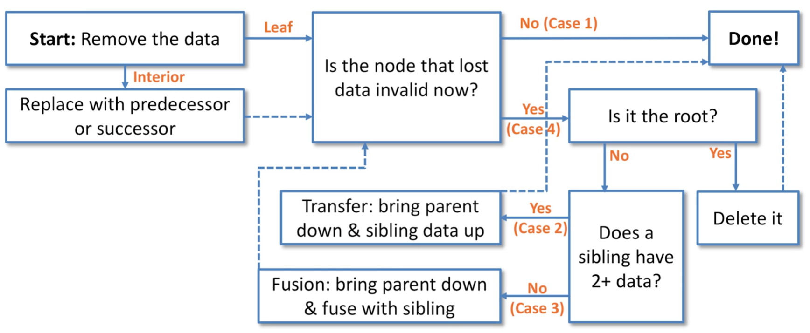

# (2,4) trees

- a special case of B-tree where multiple data and nodes are allowed
- each node can have between 2 and up to 4 nodes
- a node can have up to 3 data items
    - a node having n data items must have n+1 children
- all leaves must have same level and depth, thus making it full and balanced

## Add

- adding is always performed on a leaf node
- it might cause **overflow**, a node's no. data items exceeding the restriction
- solves by **Promotion**
    - we can promote the 2nd or 3rd item in the node the parent's node
    - this will split the node into 2 nodes
    - the data items less than the promoted note will be in the left of promoted note
    - the data items larger than the promoted note will be in the right of promoted note
- promotion maybe propogated up to the parent, so we need to perform the same steps when any node overflows

## Remove

- when removing a node. It might cause **underflow**, where the node has 0 data.

We need to maintain the order, shape and node property by **Transfer** and **Fusion**.

- transfer, when underflow occur, then we check if the immediate siblings have 2+ data. If so, we can:
    1. bring down the immediate parent
    2. promote the siblings to the parent
    3. Done
- fusion, when underflow occur and the immediate sibling (left/right) has only 1 data. Then
    1. bring down the immediate parent to current node
    2. fuse the current node and the immediate siblings
    3. it might cause further underflow up in the tree, repeat the same transfer/fusion until the node is valid

remove steps:

1. find data to be removed
2. If the node is a leaf, remove the data
3. If the node has child, then replace the removed data with predecessor/successor. Then:
4. If the node that has data removed is invalid
    1. check if it's siblings have 2+ data, if so, do transfer
    2. else do fusion
5. If fusion is done, check if fusion parent node is valid and repeat step 4 if not
6. If the node that lost data is the root, just delete it and return the new root
7. might need to do single rotation like AVL to reassign child

-trees-removal-fusion.png)

## Read further

- Splay tree. Another type of BST where rotations are performed to make the queried data the root
- so the more often queried data will be closer to the root and faster to be queried
- the less often ones will be at the bottom and slower to be accessed
- tree can still be degenerate but amortized time complexity is O(log(n))
