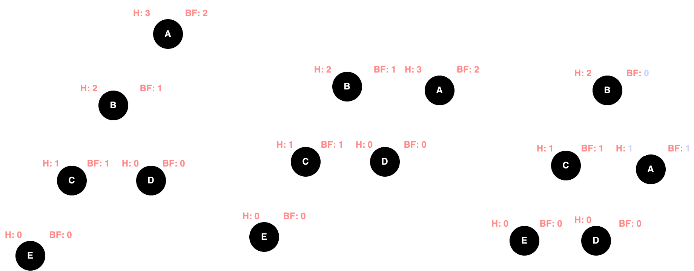
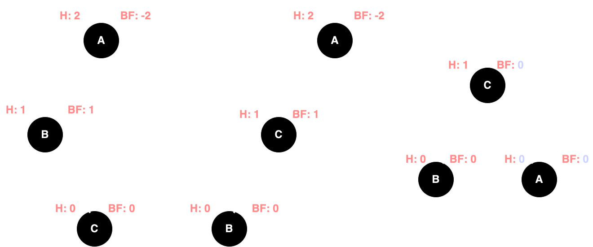
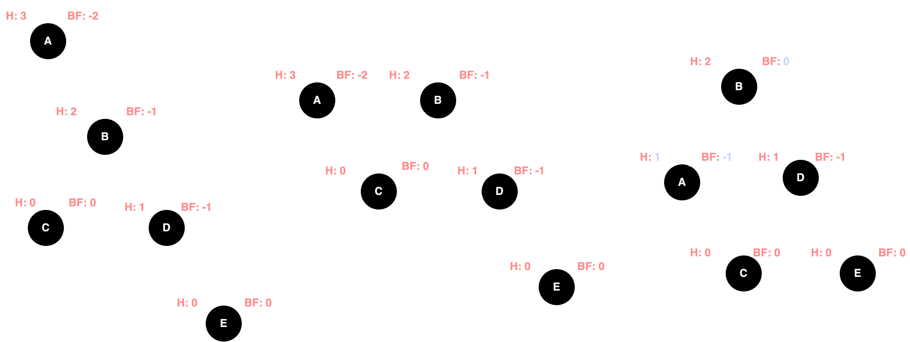
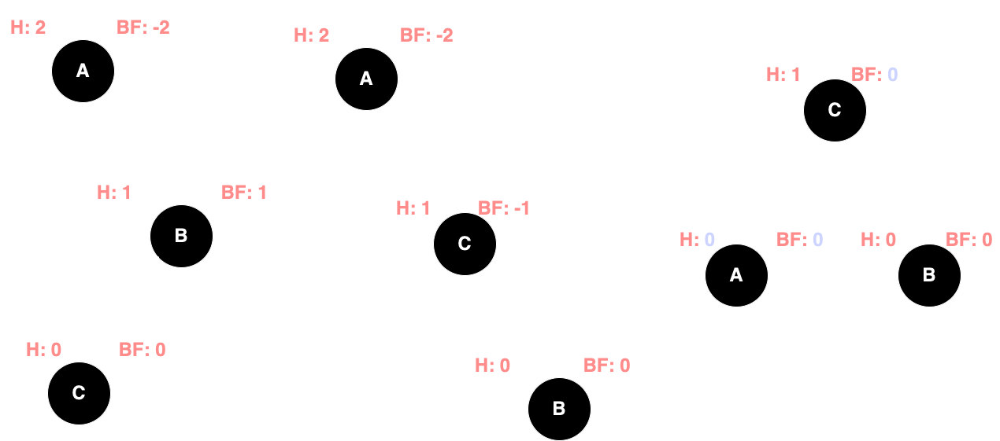
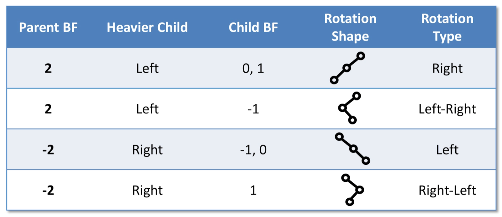

# AVL

BST has a worst case of O(n) if the tree is degenerative while AVL has a **worst case of O(log(n)) for add, remove and
search** because each operation need to maintain the **self-balancing** property

AVL shares the same **order** and **shape** properties of BST, but it has additional shape properties to restrict the
height of the tree

Key terms;

- **height**
    - a node's height is calculated from maxing left and right child height +
        1. `max(height(left), height(right)) + 1`
- **balance factors** (BF)
    - a node's BF is calculated from `height(left) - height(right)`. We can determine if the tree **has a heavier (more
      nodes) left/right subtree** from this.
    - A positive number (> 1) means it's left heavier
    - A negative number (< 1) means it's right heavier
- **balanced**
    - an AVL is considered balanced if **all nodes has a BF of `-1, 0, 1`**. It means the heights of the left
      and right subtree only differ at most by 1.
- **unbalanced**
    - an AVL is considered unbalanced if **any node has a BF of absolute value > 1 `Math.abs(BF) > 1`**

## Add and remove

Add and remove procedure is the same as BST. Just that **rebalancing and update of heights and BF** needs to be peformed

## Rotations

An AVL tree is self-balancing because when the tree is unbalanced because of add/remove, the add/remove need to
rebalance the tree by performing **rotations** on the **lowest** nodes that is imbalanced.

**null node has a height of `-1` and BF of `-1`**

- **Right rotation**
    - the node itself has a BF of `2` and child has a BF of `1, 0`. Assume node `A` is imbalance and node `B` is left
      child
    - Rotate right by:
        1. save reference to node `B`
        2. assign node `A`'s left child to node `B`'s right child
        3. assign node `B`'s right child to node `A`
        4. update height and BF of node `A`
        5. update height and BF of node `B`
        6. return new root of subtree which is node `B`
           
- **Left-right rotation**
    - It's performing **the left and then right rotation** to balance the tree. The tree shape is left heavy but the
      left
      subtree is itself right heavy. The node itself has a BF of `2` and child has a BF of `-1`.
        1. First rotate left with node `B` as the node to pivot
        2. Set node `A` left subtree to the result of node `B`'s rotation (pointer reinforcement).
        3. Then rotate right with node `A` as the node to pivot
        4. set current node to result of rotation
        5. return current node
           
- **Left rotation**
    - the node itself has a BF of `-2` and child has a BF of `-1, 0`. Assume node `A` is imbalance and node `B` is right
      child
        - Rotate left by
            1. save reference to node `B`
            2. assign node `A`'s right child to node `B`'s left child
            3. assign node `B`'s left child to node `A`
            4. update height and BF of node `A`
            5. update height and BF of node `B`
            6. return new root of subtree which is node `B`
               
- **Right-left rotation**
    - It's performing **the right and then left rotation** to balance the tree. The tree shape is right heavy but the
      right
      subtree is itself left heavy. The node itself has a BF of `-2` and child has a BF of `1`.
        1. First rotate right with node `B` as the node to pivot
        2. Set node `A` right subtree to the result of node `B`'s rotation (pointer reinforcement).
        3. Then rotate left with node `A` as the node to pivot
        4. set current node to result of rotation
        5. return current node
           

## Read further

- AVL is often compared to **Red Black Tree** as they support the same set of operation in O(logn)
- AVL is faster in lookup extensive application
- Red Black Tree is faster for general add and remove