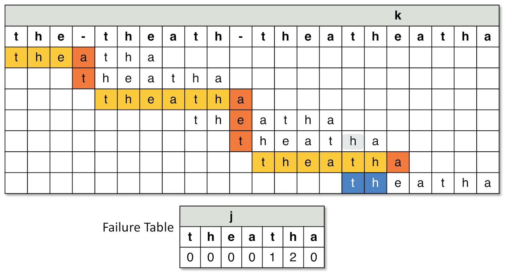

# Pattern Matching

## Key terms

- n, length of string
- m, length of pattern

## Boyer-Moore (BM)

Use preprocessing to create a hashmap of `<Char, int>` to store the last occurrence of the characters in the pattern.
Then use it to match the string/text. Matching start from the back of the pattern (right to left)

1. Preprocess and compute last occurrence hashmap
2. Iterate the text from 0 to n - m length
3. For each iteration, compare the pattern with the substring
   at `range(start: current index, end: current index + m - 1)`:
    1. start from the back of pattern to match
    2. if character is matching, keep going left and comparing with pattern
    3. if character doesn't match, stop comparing with pattern
        1. if char exist in last occurrence map
            1. if current pattern index pointer is larger than the last occurrence index, then shift pattern to align
               with unmatched character at that
               index
               `i = i + j - last occurrence index (the distance needed to increase i by
               so that i + last occurence index = mismatch char index`;
            2. else, shift the pattern matching to the right by 1 `i++`
        2. if char doesn't exist in pattern, then shift the pattern completely over to the index next to the unmatched
           char

```java
   public static int boyerMoore(String text, String pattern) {
    var lastOccurrenceMap = buildLastOccurrenceMap(pattern);
    int n = text.length();
    int m = pattern.length();
    int i = 0;

    while (i <= n - m) {
        int j = m - 1;

        while (j >= 0 && text.charAt(i + j) == pattern.charAt(j)) {
            j--;
        }
        if (j == -1) {
            return i;
        }

        char unmatchedChar = text.charAt(i + j);
        int lastOccurrenceIndex = lastOccurrenceMap.getOrDefault(unmatchedChar, -1);

        i += lastOccurrenceIndex < j ? j - lastOccurrenceIndex : 1;
    }
    return -1;
}

public static HashMap<Character, Integer> buildLastOccurrenceMap(String pattern) {
    HashMap<Character, Integer> map = new HashMap<>();
    for (int i = 0; i < pattern.length(); i++) {
        map.put(pattern.charAt(i), i);
    }
    return map;
}
```

### Time complexity

- best
    - O(m), single occurrence
    - O(mn), all occurrence
- worst
    - o(mn), where the mismatch index is at 0. e.g. `text: aaaaaaaaaaaa, pattern: baaaa`

## Knuth-Morris-Pratt (KMP)

Preprocess the pattern and compute the **Failure table** to help align the **prefix of the pattern** with the **suffix
of the text** when mismtach occurs

Given Failure table (f), `f[i]` store the length of the longest prefix/suffix pair of `pattern[0,1....i]

1. Preprocess the pattern and compute the failure table
    1. Initialize an array `f` of `m` size
    2. Initialize two pointers `i` & `j`. `i` is pointing at the prefix of pattern while j is the current iteration of
       pattern. Default `f[0]` to be 1
    3. While `j < m`, do the following
    4. Starting from index 1, iterate over the pattern
        1. if `p[i]` = `p[j]`, set `f[j]` to `i + 1` and move both `i` & `j` by 1
        2. if `p[i] != p[j] and i = 0`, this means no previous match found yet. Set `f[j] = 0` and move `j` forward by 1
        3. if `p[i] != p[j] and i != 0`, this mean previously there is prefix/suffix pair at `p[i-1]`. So we
           set `i = f[i - 1]` (which is the index where the prefix/suffix pair at `p[i-1]` stop)
           
2. Set `i` to be the pointer for iteration of text and `j` to be the pointer for iteration of pattern
3. While `i < n`, do the following:
    1. if `t[i] = t[j]`, increase both `i` and `j` by 1
    2. if `j == m - 1`, pattern match found
        1. return `i - m` for single occurrence
        2. set `j = f[m - 1]` for all occurrence, move `i` forward by 1
    3. if `t[i] != t[j] && j = 0`, no matches found previously. Only move forward in text by increase `i+1`
    4. if `t[i] != t[j] && j != 0`, previously matching characters found. Look up the failure table and find the length
       of the prefix/suffix pair at `j - 1` in order to skip to the index after the prefix
        1. set `j = f[j - 1]`

```java
    public static int[] kruthMorrisPratt(String text, String pattern) {
    List<Integer> matchedIndexes = new ArrayList<Integer>();
    int[] failureTable = buildFailureTable(pattern);
    int n = text.length();
    int m = pattern.length();

    int i = 0;
    int j = 0;

    while (i < n) {
        if (text.charAt(i) == pattern.charAt(j)) {
            if (j == m - 1) {
                matchedIndexes.add(i - j);

                // reset j to match prefix/suffix at j - 1
                j = failureTable[j - 1];
            } else {
                j++;
            }
            i++;
        } else if (text.charAt(i) != pattern.charAt(j) && j == 0) {
            i++;
        } else {
            // previously matched character, look up failure table and skip the length of prefix/suffix of character at j - 1
            j = failureTable[j - 1];
        }
    }
    return matchedIndexes.stream().mapToInt(Integer::intValue).toArray();
}

private static int[] buildFailureTable(String pattern) {
    int m = pattern.length();
    int[] table = new int[m];
    table[0] = 0;

    int prefixIndex = 0;
    int curr = 1;
    while (curr < m) {
        if (pattern.charAt(prefixIndex) == pattern.charAt(curr)) {
            table[curr] = prefixIndex + 1;
            prefixIndex++;
            curr++;
        } else if (pattern.charAt(prefixIndex) != pattern.charAt(curr) && prefixIndex == 0) {
            table[curr] = 0;
            curr++;
        } else {
            prefixIndex = table[prefixIndex - 1];
        }
    }
    return table;
}

```

### Time complexity

- best
    - O(m), single occurrence
    - O(m + n), all occurrence (Takes only `m` time to build the failure table & `n` iteration for finding match)
- worst
    - o(m + n)
    - take `2m` time to build the failure table, plus `n` time to iterate through the text

## Rabin-Karp (RK)

Comparison based on **hash of pattern and text**, not just the actual character. Use the **Rabin Fingerprint** for
rolling hash of updating the text hash when the algorithm is moving along from left to right of text

### Rabin Fingerprint

Hash function that takes a **base value**, then multiply the **integer value of a character** with **the base raised to
the
exponent based on the char's index in the string **

- `Hash(pattern) = h(p[0]) * base ^ m - 1 + h(p[1]) * base ^ m - 2 + h(p[2]) * base ^ m - 2..... h(p[p.length - 1]) * base ^ 0`
- e.g. let base be `10`, string be `90215`. So the int value is just the integer value, the hash of the text is:
    - `9 * 10^4 + 0 * 10^3 + 2 * 10^2 + 1 * 10^1 + 5 * 10^0

When moving to the right of the text

- subtract the existing hash with the contribution of the old character
- multiply the existing by the base, which promote all the existing characters to their new position in the head
- add the hash of new character
- `(oldHash - (oldChar * base ^ m - 1)) * base + newChar * base ^ 0`

## Read further

- the Galil Rule, use concept call period to represent shortest repeating substring

