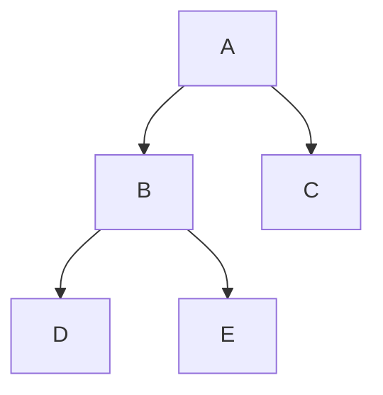
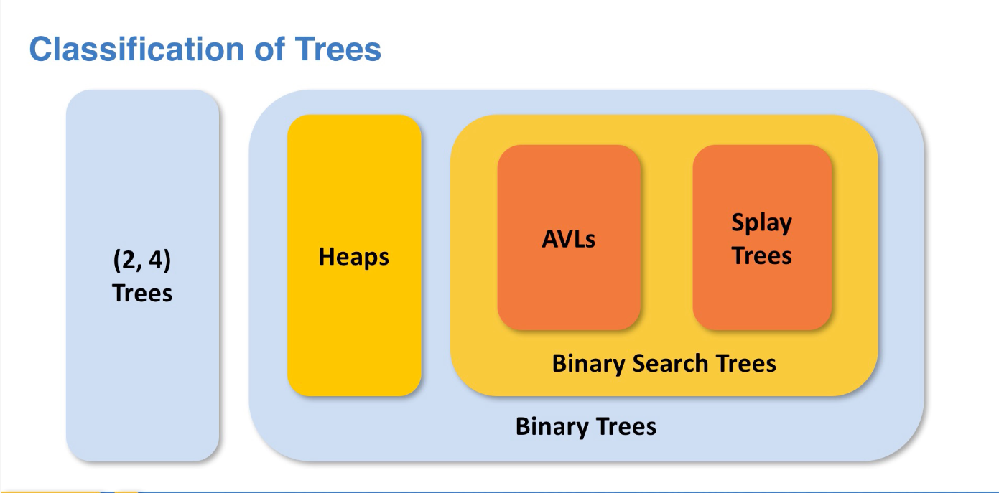
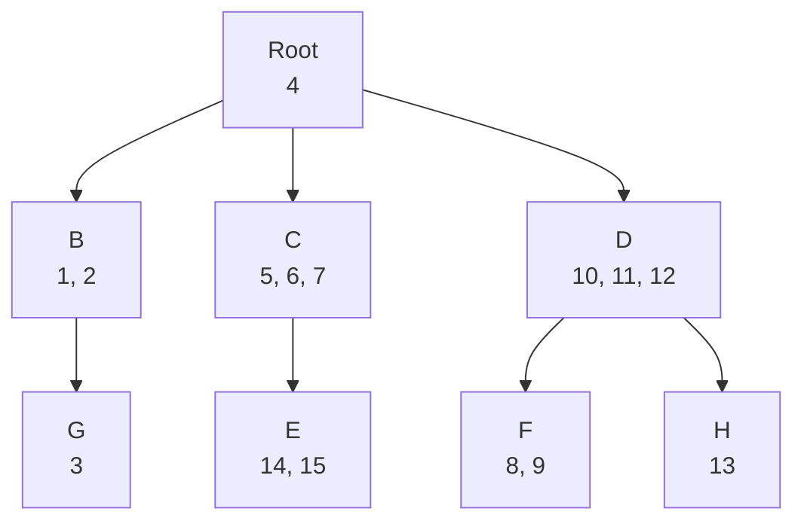
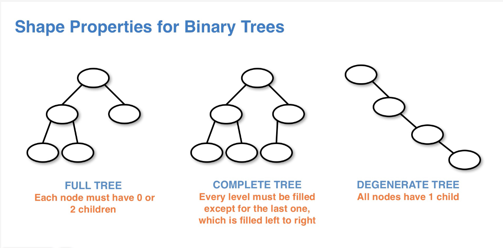
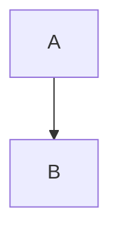
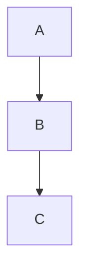
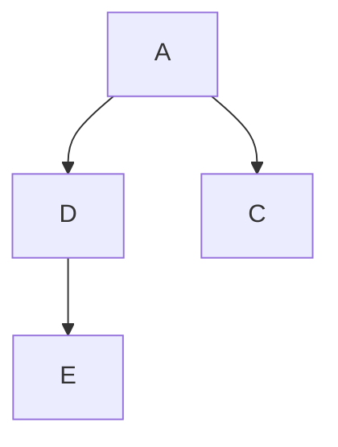

# Tree

## Terminology

- Depth: the distance of node from the root
- Height: The distance from the further nodes to the current node. e.g.



- Height 2: `A`
- Height 1: `B`
- Height 0: `D`,`E`,`C`

## Classification of Trees



## 2-4 trees

- each node (other than leaf node) can have between 2 and 4 children
- balanced, all paths from the root to leave has the same length



## Binary Tree and Binary Search Tree

### Binary Tree

- each node can have at most 2 children
- children are label left and right
- left child precedes the right child (not actual data stored in node)

#### Shapes of Binary Tree



- NOTE: complete tree must have every level filled except for the last level. The last level must be filled from left to
  right with no gap between cousins

### Binary Search Tree

Same properties as Binary Tree but with additional data ordering:

- data in left children must be less than that of the parent node
- data in right children must be greater than that of the parent node
- apply to all nodes in the tree

This means:

- all data in the left subtree of a node will be less than the data in the node
- all data in the right subtree of a node will be greater than the data in the node

This structure allows efficient search in $O(log(n))$ time if the tree is complete/full. But still $(n)$ if the tree is
denegerative.

PS: the number of structurally unique binary search trees given n elements, is equal to the nth Catalan number.

## Traversal methods

- DFS, Depth First Search (Stack based)
    - preorder
    - inorder
    - postorder
- BFS, Breath First Search (Queue based)
    - inlevel order

## Look ahead vs Pointer reinforcement (using return)

### look ahead

- Keep track of parent node rather than the current node
- Never really reach a null node
- just check whether the child is null before traversing to that direction
- **Add** when child is null
- less effective for complex tree structure

### Pointer reinforcement (using return)

- use the return field to return the node that needs to be added
    - if traverse left, return left child
    - if traverse right, return right child
- set the left/right pointer
    - what is already there will still be there
    - but null would be set to the new node being added
- Move the responsibility of restructuring after the child's recursive call

## Remove in BST

- Three cases of nodes to be removed:

1. **Zero child**
    - can return null directly to the parent



2. **Single child**
    - return left/right child to the parent



3. **Two child**
    - find **Predecessor/Successor** of the current node
        - **Predecessor**, the largest node smaller than the current node, which is the rightmost node in the left
          subtree
        - **Successor**, the smallest node larger than the current node, which is the leftmost node in the right subtree
    - recursive call to remove predecessor/successor
    - set current node left/right to the subtree after removing predecessor/successor
    - set current node data to the predecessor/successor node's data
    - return current


AFTER REMOVAL OF NODE B



### Codes

```java
import assignment.TreeNode;

public T remove(TreeNode<T> root, T target) {
    // { T node, TreeNode<T> left, TreeNode<T> right }
    TreeNode<T> dummy = new TreeNode<T>(null);
    root = removeR(root, target);
    return dummy.data;
}

public void removeR(TreeNode<T> curr, T target, TreeNode<T> dummy) {
    if (curr == null) {
        return null;
    } else if (curr.data < target) {
        curr.right = removeR(curr.right, target, dummy);
    } else if (curr.data > target) {
        curr.left = remove(curr.left, target, dummy);
    } else {
        dummy.data = curr.data;
        // Zero Child
        if (curr.left == null && curr.right == null) {
            return null;
        }
        // Single Child
        else if (curr.left == null) {
            return curr.right;
        } else if (curr.right == null) {
            return curr.left;
        }
        // Two child
        else {
            TreeNode<T> dummy2 = new TreeNode<T>(null);
            curr.left = removePredecessor(curr.left, dummy2);
            curr.data = dummy2.data;
        }
    }

    return curr;
}

public T removePredecessor(TreeNode<T> curr, TreeNode<T> dummy) {
    if (curr.right == null) {
        dummy.data = curr.data;
        return null;
    } else {
        curr.right = removePredecessor(curr.right, target, dummy);
        return curr;
    }
}


```